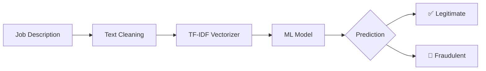

# 🕵️ Fake Job Prediction System

### NLP-Powered Fraudulent Job Posting Detection

Detect fraudulent job listings using **Natural Language Processing** and **Machine Learning**.

Built with **TF-IDF**, **Scikit-Learn**, and **Streamlit** for fast, real-time predictions.


**🚀 Live Demo:** https://fakeprediction-a8wpvpp3uifhwxeduehaev.streamlit.app/

> Helping job seekers identify scam job postings before they become victims.

---

# 📖 Overview

### 🌐 Live Application

**https://fakeprediction-a8wpvpp3uifhwxeduehaev.streamlit.app/**

<br>

> **Helping job seekers identify scam job postings before they become victims.**

</div>

---

# 📖 Overview

Recruitment fraud has become increasingly common across online job portals.

This project applies **Natural Language Processing (NLP)** and **Machine Learning** to automatically distinguish between **legitimate** and **fraudulent** job advertisements based solely on textual content.

Using **TF-IDF Vectorization** combined with a trained **Scikit-Learn classifier**, the application predicts whether a job posting is genuine through an intuitive Streamlit web interface.

---

# ✨ Key Features

| Feature | Description |
|---------|-------------|
| 📝 Text Classification | Predicts whether a job posting is legitimate or fraudulent |
| ⚡ Real-Time Inference | Instant predictions through a Streamlit interface |
| 🧠 NLP Pipeline | TF-IDF feature extraction for textual understanding |
| 🤖 Machine Learning | Trained supervised classification model |
| 🌐 Web Deployment | Accessible directly from any modern browser |
| 🚀 Lightweight | Fast inference with minimal dependencies |
| 📦 Easy Deployment | Simple setup using Python and Streamlit |

---

# 🏗 System Architecture

```text
                     Job Description
                            │
                            ▼
                 Text Preprocessing
                            │
                            ▼
                 TF-IDF Vectorization
                            │
                            ▼
              Trained Machine Learning Model
                            │
                            ▼
         ┌─────────────────────────────┐
         │ Legitimate      Fraudulent │
         └─────────────────────────────┘
````

---

# 🧠 Machine Learning Pipeline

```text
Input Text
    │
    ▼
Lowercasing
    │
    ▼
Cleaning & Tokenization
    │
    ▼
TF-IDF Feature Extraction
    │
    ▼
Classification Model
    │
    ▼
Prediction
```

---

# 🛠 Technology Stack

| Category             | Technologies              |
| -------------------- | ------------------------- |
| Programming Language | Python                    |
| Machine Learning     | Scikit-Learn              |
| NLP                  | TF-IDF Vectorizer         |
| Model Serialization  | Pickle                    |
| Web Framework        | Streamlit                 |
| Deployment           | Streamlit Community Cloud |

---

# 📂 Project Structure

```text
fakeprediction/
│
├── app.py
├── train_model.py
├── fake_job_model.pkl
├── tfidf_vectorizer.pkl
├── requirements.txt
├── README.md
│
└── assets/
```

---

# 🚀 Getting Started

## 1️⃣ Clone Repository

```bash
git clone https://github.com/VasuML07/fakeprediction.git

cd fakeprediction
```

---

## 2️⃣ Create Virtual Environment

### Windows

```powershell
python -m venv venv

venv\Scripts\activate
```

### macOS / Linux

```bash
python3 -m venv venv

source venv/bin/activate
```

---

## 3️⃣ Install Dependencies

```bash
pip install -r requirements.txt
```

---

## 4️⃣ Run the Application

```bash
streamlit run app.py
```

The application will automatically launch in your browser.

---

# 💻 Example Usage

### Input

```text
We are looking for an experienced Python Developer with knowledge of APIs,
Git, SQL, and Machine Learning.
```

### Prediction

```text
✅ Legitimate Job Posting
```

---

### Input

```text
Earn $5000 per week working only 2 hours a day.
No experience required.
Send your bank details immediately.
```

### Prediction

```text
🚫 Fraudulent Job Posting
```

---

# 📊 Model Information

| Component          | Details                   |
| ------------------ | ------------------------- |
| Feature Extraction | TF-IDF Vectorizer         |
| Learning Type      | Supervised Classification |
| Input              | Job Description Text      |
| Output             | Legitimate / Fraudulent   |
| Serialization      | Pickle (.pkl)             |

---

# 📈 Prediction Workflow



---

# 🎯 Project Highlights

* NLP-based text classification
* Real-time prediction interface
* Lightweight deployment
* Simple architecture
* Beginner-friendly codebase
* Production-ready inference pipeline
* Clean separation of model and frontend

---

# 🔮 Future Roadmap

* [ ] Upgrade to Transformer Models (BERT/RoBERTa)
* [ ] Explainable AI (SHAP/LIME)
* [ ] Confidence Score Visualization
* [ ] Docker Support
* [ ] REST API with FastAPI
* [ ] Batch Prediction
* [ ] CI/CD Pipeline
* [ ] Model Retraining Pipeline
* [ ] User Authentication
* [ ] Prediction History Dashboard

---

# 🤝 Contributing

Contributions are welcome.

If you'd like to improve this project:

1. Fork the repository
2. Create a feature branch

```bash
git checkout -b feature/amazing-feature
```

3. Commit your changes

```bash
git commit -m "Add amazing feature"
```

4. Push to GitHub

```bash
git push origin feature/amazing-feature
```

5. Open a Pull Request

---

# 📄 License

This project is licensed under the **MIT License**.

Feel free to use, modify, and distribute it for personal or commercial purposes.

---

# 👨‍💻 Author

<div align="center">

## **Avinash**

Machine Learning • Artificial Intelligence • NLP • Data Science

**GitHub**

https://github.com/VasuML07

---

### ⭐ If this project helped you, consider giving it a Star!

It motivates future improvements and helps others discover the project.

</div>
```
